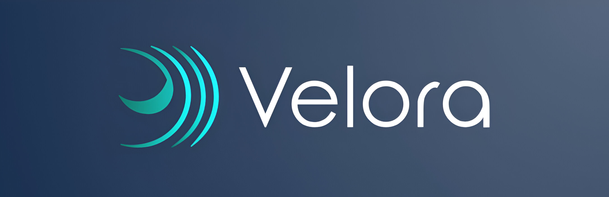

---
hide:
  - navigation
---

*Velora, a lightweight and modular Liquid Reinforcement Learning (RL) framework.*

---

    <a href="/" target="_blank" style="text-align: center;">
        <svg xmlns="http://www.w3.org/2000/svg" height="32" width="28" viewBox="0 0 448 512"><path fill="rgba(255, 255, 255, 0.7)" d="M96 0C43 0 0 43 0 96V416c0 53 43 96 96 96H384h32c17.7 0 32-14.3 32-32s-14.3-32-32-32V384c17.7 0 32-14.3 32-32V32c0-17.7-14.3-32-32-32H384 96zm0 384H352v64H96c-17.7 0-32-14.3-32-32s14.3-32 32-32zm32-240c0-8.8 7.2-16 16-16H336c8.8 0 16 7.2 16 16s-7.2 16-16 16H144c-8.8 0-16-7.2-16-16zm16 48H336c8.8 0 16 7.2 16 16s-7.2 16-16 16H144c-8.8 0-16-7.2-16-16s7.2-16 16-16z"/></svg>
        
Docs

    </a>
    <a href="https://github.com/Achronus/velora/" target="_blank"  style="text-align: center;">
        <svg xmlns="http://www.w3.org/2000/svg" height="32" width="28" viewBox="0 0 640 512"><path fill="rgba(255, 255, 255, 0.7)" d="M392.8 1.2c-17-4.9-34.7 5-39.6 22l-128 448c-4.9 17 5 34.7 22 39.6s34.7-5 39.6-22l128-448c4.9-17-5-34.7-22-39.6zm80.6 120.1c-12.5 12.5-12.5 32.8 0 45.3L562.7 256l-89.4 89.4c-12.5 12.5-12.5 32.8 0 45.3s32.8 12.5 45.3 0l112-112c12.5-12.5 12.5-32.8 0-45.3l-112-112c-12.5-12.5-32.8-12.5-45.3 0zm-306.7 0c-12.5-12.5-32.8-12.5-45.3 0l-112 112c-12.5 12.5-12.5 32.8 0 45.3l112 112c12.5 12.5 32.8 12.5 45.3 0s12.5-32.8 0-45.3L77.3 256l89.4-89.4c12.5-12.5 12.5-32.8 0-45.3z"/></svg>
        
Code

    </a>

---

**Velora** is a lightweight and extensible framework built on top of powerful libraries like [Gymnasium [:material-arrow-right-bottom:]](https://gymnasium.farama.org/) and [PyTorch [:material-arrow-right-bottom:]](https://pytorch.org/), specializing in a unique approach to Deep Reinforcement Learning (RL) algorithms, a paradigm we call *Liquid RL*.

Instead of Fully-connected Networks, Velora combines [Liquid Neural Networks [:material-arrow-right-bottom:]](https://arxiv.org/abs/2006.04439) (LNNs) with [Neural Circuit Policies [:material-arrow-right-bottom:]](https://arxiv.org/abs/1803.08554) (NCPs), specifically [Ordinary Neural Circuits [:material-arrow-right-bottom:]](https://proceedings.mlr.press/v119/hasani20a.html) (ONCs).

These two components have interesting benefits:

- LNNs are a powerful RNN architecture that learns system dynamics, not just data patterns.
- NCPs focus on sparsely connected neurons with distinct functions, mimicking biological behaviour.

From what we've seen, these networks are powerful, small-scale architectures that excel in model explainability, making them perfect for control tasks.

Velora offers Liquidfied PyTorch-based implementations of RL algorithms, designed to be intuitive, easy to use, and customizable.

In other frameworks, we've seen a trend of heavy abstraction in favour of minimal lines of code. Our approach aims to offer a best of both worlds, abstracting code away but making the details explainable on the backend, while giving you the freedom to customize as needed.

-   :material-rocket-launch:{ .lg .middle } **Getting Started**

    ---

    What are you waiting for?!

    [:octicons-arrow-right-24: Get Started](starting/index.md)

-   :material-scale-balance:{ .lg .middle } **Open Source, MIT**

    ---

    Velora is licensed under the MIT License.

    [:octicons-arrow-right-24: License](starting/license.md)

## Active Development

**Velora** is a tool that is continuously being developed. There's still a lot to do to make it a fully functioning framework, such as detailed API documentation, and more RL algorithms.

Our goal is to provide a quality open-source product that works 'out-of-the-box' that everyone can experiment with, and then gradually fix unexpected bugs and introduce more features on the road to a [`v1`](#active-development) release.

-   :material-map:{ .lg .middle } **Roadmap**

    ---

    Check out what we have planned for Velora.

    [:octicons-arrow-right-24: Explore](starting/roadmap.md)

