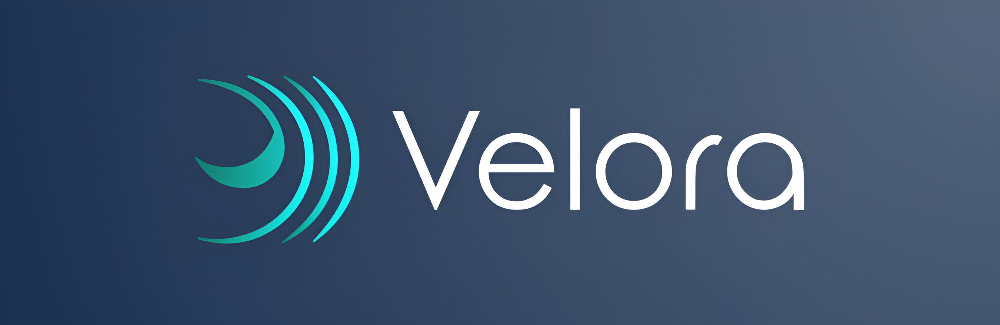

---
hide:
  - navigation
---

*Velora, a Reinforcement Learning research framework for building lightweight, adaptable, transparent and stateful agents.*

---

    <a href="/" target="_blank" style="text-align: center;">
        <svg xmlns="http://www.w3.org/2000/svg" height="32" width="28" viewBox="0 0 448 512"><path fill="rgba(255, 255, 255, 0.7)" d="M96 0C43 0 0 43 0 96V416c0 53 43 96 96 96H384h32c17.7 0 32-14.3 32-32s-14.3-32-32-32V384c17.7 0 32-14.3 32-32V32c0-17.7-14.3-32-32-32H384 96zm0 384H352v64H96c-17.7 0-32-14.3-32-32s14.3-32 32-32zm32-240c0-8.8 7.2-16 16-16H336c8.8 0 16 7.2 16 16s-7.2 16-16 16H144c-8.8 0-16-7.2-16-16zm16 48H336c8.8 0 16 7.2 16 16s-7.2 16-16 16H144c-8.8 0-16-7.2-16-16s7.2-16 16-16z"/></svg>
        
Docs

    </a>
    <a href="https://github.com/Achronus/velora/" target="_blank"  style="text-align: center;">
        <svg xmlns="http://www.w3.org/2000/svg" height="32" width="28" viewBox="0 0 640 512"><path fill="rgba(255, 255, 255, 0.7)" d="M392.8 1.2c-17-4.9-34.7 5-39.6 22l-128 448c-4.9 17 5 34.7 22 39.6s34.7-5 39.6-22l128-448c4.9-17-5-34.7-22-39.6zm80.6 120.1c-12.5 12.5-12.5 32.8 0 45.3L562.7 256l-89.4 89.4c-12.5 12.5-12.5 32.8 0 45.3s32.8 12.5 45.3 0l112-112c12.5-12.5 12.5-32.8 0-45.3l-112-112c-12.5-12.5-32.8-12.5-45.3 0zm-306.7 0c-12.5-12.5-32.8-12.5-45.3 0l-112 112c-12.5 12.5-12.5 32.8 0 45.3l112 112c12.5 12.5 32.8 12.5 45.3 0s12.5-32.8 0-45.3L77.3 256l89.4-89.4c12.5-12.5 12.5-32.8 0-45.3z"/></svg>
        
Code

    </a>

---

**Velora** is a Reinforcement Learning (RL) research framework for exploring ways to build lightweight, adaptable, transparent and stateful agents that move away from the world of Large Language Models (LLMs).

By design, it focuses on tasks centred around robotics and continuous control problems to bring us closer to unlocking physical agents that are useful for real-world use cases.

Built with PyTorch, it provides modular building blocks that plug into common RL agent algorithms (such as [PPO [:material-arrow-right-bottom:]](https://arxiv.org/abs/1707.06347) and [TD3 [:material-arrow-right-bottom:]](https://arxiv.org/abs/1802.09477)) and environment backends like [MJWarp [:material-arrow-right-bottom:]](https://mujoco.readthedocs.io/en/stable/mjwarp/index.html) and [Isaac Lab [:material-arrow-right-bottom:]](https://isaac-sim.github.io/IsaacLab/main/index.html) for rapid iteration and experimentation.

Velora is **not** a replacement for other popular RL libraries (such as [Stable Baselines3 [:material-arrow-right-bottom:]](https://sb3-contrib.readthedocs.io/en/master/index.html) or [RLlib [:material-arrow-right-bottom:]](https://docs.ray.io/en/latest/rllib/index.html)) and is purely a framework for experimenting with unconventional models and techniques that have real potential.

-   :material-rocket-launch:{ .lg .middle } **Getting Started**

    ---

    What are you waiting for?!

    [:octicons-arrow-right-24: Get Started](starting/index.md)

-   :material-scale-balance:{ .lg .middle } **Open Source, Apache 2.0**

    ---

    Velora is licensed under the Apache License 2.0.

    [:octicons-arrow-right-24: License](license.md)

